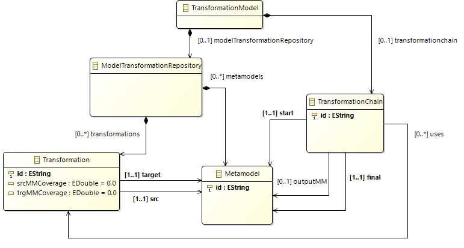

# Selection of Model Transformation Chains with MOMoT

Add chainoptimisation and chain selection project along with the epsilon java standalone projects as mentioned in the github repository https://github.com/lowcomote/chain-optimisation.git.

This project includes an ecore model and the Henshin rules to find optimal transformation chains with MOMoT.

* Ecore model => ./metamodel
* Henshin Rules => ./transformations
* Fitness calculation => ./src/trafochainselection/demo
* Test instances => ./problem

